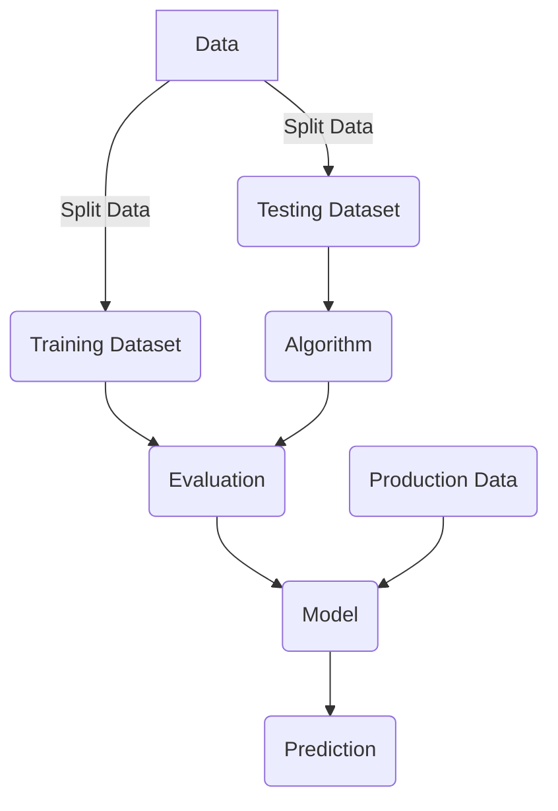

### Anthony G. Tellez

A personal website to aggregate public presentations, blog posts in the domains of machine learning, cyber security and cloud ops. 

[Conference Presentations](/archive.html?tag=Conference){:.button.button--primary.button--rounded.button--lg}


### Interests


```chart
{
  "type": "radar",
  "data": {
    "labels": [
      "Machine Learning",
      "Cryptography",
      "Visualization",
      "Deep Learning",
      "Japanese",
      "Traveling",
      "Cooking"
    ],
    "datasets": [
      {
        "label": "My Interests",
        "backgroundColor": "rgba(255,99,132,0.2)",
        "borderColor": "rgba(255,99,132,1)",
        "pointBackgroundColor": "rgba(255,99,132,1)",
        "pointBorderColor": "#fff",
        "pointHoverBackgroundColor": "#fff",
        "pointHoverBorderColor": "rgba(255,99,132,1)",
        "data": [
          90,
          80,
          100,
          80,
          96,
          98,
          80
        ]
      }
    ]
  },
  "options": {}
}
```

